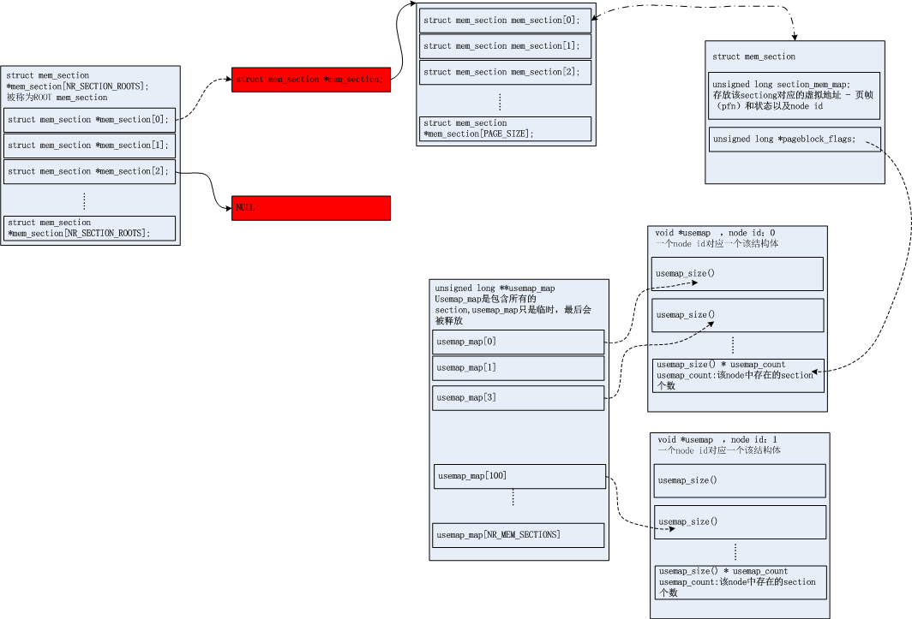

# sparse init

[TOC]

SPARSEMEM内存模型用来支持memory hotplug。对此只是简单分析。

sparse memory 结构：

sparse中提出section，代码表示为mem_section。section就是比page更大一些的内存区域，但是呢一般意义上又比node的范围要小些。

整个系统的物理内存就被分成一个个section，并由mem_section结构体表示。而这个结构体中保存了该section范围内struct page结构体的地址。 

## arm64 sparse配置

### MAX_PHYSMEM_BITS & SECTION_SIZE_BITS

```c
#ifdef CONFIG_SPARSEMEM
#define MAX_PHYSMEM_BITS	48
#define SECTION_SIZE_BITS	30
#endif
```

MAX_PHYSMEM_BITS：表示系统支持的最大物理内存

SECTION_SIZE_BITS：表示一个SECTION的大小，即1<<30 = 1G bytes大小

### NR_MEM_SECTIONS

```c
/* SECTION_SHIFT	#bits space required to store a section # */
#define SECTIONS_SHIFT	(MAX_PHYSMEM_BITS - SECTION_SIZE_BITS) /* 48 - 30 = 18*/
/* section的个数 = 1 << MAX_PHYSMEM_BITS / (1 << SECTION_SIZE_BITS ) */
#define NR_MEM_SECTIONS		(1UL << SECTIONS_SHIFT) 
```

NR_MEM_SECTIONS：系统中SECTIONS的个数，即1 << MAX_PHYSMEM_BITS / (1 << SECTION_SIZE_BITS ) 

### PAGES_PER_SECTION

```c
#define PFN_SECTION_SHIFT	(SECTION_SIZE_BITS - PAGE_SHIFT) /* 30 - 12 = 18 */
/* 一个section中包含的页帧 */
#define PAGES_PER_SECTION       (1UL << PFN_SECTION_SHIFT)
```

PAGES_PER_SECTION：表示一个SECTION中有多少页，即1<<SECTION_SIZE_BITS / (1<<PAGE_SHIFT)


### SECTIONS_PER_ROOT

```c
/* 一个root mem_section中有多少个子mem_section */
#define SECTIONS_PER_ROOT       (PAGE_SIZE / sizeof (struct mem_section))
```

SECTIONS_PER_ROOT：表示一个ROOT SECTION中有多少个子SECTION。至于为什么这个定义还不清楚。

### NR_SECTION_ROOTS

```c
/* NR_MEM_SECTIONS / SECTIONS_PER_ROOT，ROOT SECTION的数量 */
#define NR_SECTION_ROOTS	DIV_ROUND_UP(NR_MEM_SECTIONS, SECTIONS_PER_ROOT)
```

NR_SECTION_ROOTS：表示需要多少个ROOT SECTION

### pfn_to_section_nr

```c
/* 页帧(pfn)号到section号的转换 */
#define pfn_to_section_nr(pfn) ((pfn) >> PFN_SECTION_SHIFT) /* 30 - 12 = 18 */
```

pfn_to_section_nr：页帧号(pfn)转换到section号。即该页帧属于的section

虚拟地址，页帧，section_nr

pfn = 虚拟地址 >> PAGE_SHIFT

section_nr = pfn >> PFN_SECTION_SHIFT

## sparse memory初始化

初始化路径，以arm64为例。

start_kernel->setup_arch->paging_init->bootmem_init

### bootmem_init

```c
#define PFN_UP(x)	(((x) + PAGE_SIZE-1) >> PAGE_SHIFT)
#define PFN_DOWN(x)	((x) >> PAGE_SHIFT)

void __init bootmem_init(void)
{
	unsigned long min, max;

	min = PFN_UP(memblock_start_of_DRAM());
	max = PFN_DOWN(memblock_end_of_DRAM());
	/*
	 * Sparsemem tries to allocate bootmem in memory_present(), so must be
	 * done after the fixed reservations.
	 */
	arm64_memory_present();
	sparse_init();
	zone_sizes_init(min, max);

	high_memory = __va((max << PAGE_SHIFT) - 1) + 1;
	max_pfn = max_low_pfn = max;
}
```

### arm64_memory_present

```c
/**
 * memblock_region_memory_base_pfn - Return the lowest pfn intersecting with the 
 * memory region
 * @reg: memblock_region structure
 */
static inline unsigned long memblock_region_memory_base_pfn(const struct memblock_region *reg)
{
	return PFN_UP(reg->base);
}

/**
 * memblock_region_memory_end_pfn - Return the end_pfn this region
 * @reg: memblock_region structure
 */
static inline unsigned long memblock_region_memory_end_pfn(const struct memblock_region *reg)
{
	return PFN_DOWN(reg->base + reg->size);
}

static void arm64_memory_present(void)
{
	struct memblock_region *reg;
	for_each_memblock(memory, reg){
		/* 对内存探测得出的每个region调用memory_present() */
		memory_present(0, memblock_region_memory_base_pfn(reg),
			       memblock_region_memory_end_pfn(reg));
	}
}
```

### memory_present

```c
void __init memory_present(int nid, unsigned long start, unsigned long end)
{
	unsigned long pfn;

	start &= PAGE_SECTION_MASK;
	mminit_validate_memmodel_limits(&start, &end);
	for (pfn = start; pfn < end; pfn += PAGES_PER_SECTION) {
		/* pfn所属于的section号 */
		unsigned long section = pfn_to_section_nr(pfn);
		struct mem_section *ms;
		sparse_index_init(section, nid);
		set_section_nid(section, nid);
		/* ms为root mem_setcion中对应子section的的mem_section */
		ms = __nr_to_section(section);
		if (!ms->section_mem_map)
			/* 标记section已经存在,并且将nid保存到section_mem_map中 */
			ms->section_mem_map = sparse_encode_early_nid(nid) | SECTION_MARKED_PRESENT;
	}
}
```

#### sparse_index_init

```c
static int __meminit sparse_index_init(unsigned long section_nr, int nid)
{
	/* 
	 * section_nr / SECTIONS_PER_ROOT，找到该section_nr对应的root号
	 */
	unsigned long root = SECTION_NR_TO_ROOT(section_nr);
	struct mem_section *section;
	/* root section不为空 */
	if (mem_section[root])
		return -EEXIST;

	/* 分配 SECTIONS_PER_ROOT * sizeof(struct mem_section)大小内存，并返回地址 */
	section = sparse_index_alloc(nid);
	/* 将分配的子section指针保存到section对应的root section中 */
	mem_section[root] = section;
	return 0;
}
```

#### sparse_index_alloc

```c
static struct mem_section noinline __init_refok *sparse_index_alloc(int nid)
{
	struct mem_section *section = NULL;
	unsigned long array_size = SECTIONS_PER_ROOT * sizeof(struct mem_section);
	if (slab_is_available()) {
		if (node_state(nid, N_HIGH_MEMORY))
			section = kzalloc_node(array_size, GFP_KERNEL, nid);
		else
			section = kzalloc(array_size, GFP_KERNEL);
	} else {
		section = memblock_virt_alloc_node(array_size, nid);
	}
	return section;
}
```

#### set_section_nid

```c
static u8 section_to_node_table[NR_MEM_SECTIONS];
static void set_section_nid(unsigned long section_nr, int nid)
{
	/* section_to_node_table为一个全局变量 */
	section_to_node_table[section_nr] = nid;
}
```

### __nr_to_section

```c


static inline struct mem_section *__nr_to_section(unsigned long nr)
{
	/* root mem_section是否为空，该值指向子mem_section */
	if (!mem_section[SECTION_NR_TO_ROOT(nr)])
		return NULL;
	/**
	 * mem_section为一个指针数组，元素类型都是struct mem_section类型的指针
	 * mem_section[SECTION_NR_TO_ROOT(nr)][nr & SECTION_ROOT_MASK]可以分开看
	 * mem_section[SECTION_NR_TO_ROOT(nr)]表示一个struct mem_section的指针，该指针
	 * 是在sparse_index_init中赋值的。
	 * mem_section[SECTION_NR_TO_ROOT(nr)][nr & SECTION_ROOT_MASK]写成指针的形式为：
	 * *(mem_section[SECTION_NR_TO_ROOT(nr)] + (nr & SECTION_ROOT_MASK))
	 * 这里用了C语言二维数组和指针的关系，二维数组最终也是转换成指针的方式进行访问的。
	 * 所以二维数组的存储不一定是连续的，只有直接定义的才是连续的，这里充分运用了数组和指针的关系。
	 */
	return &mem_section[SECTION_NR_TO_ROOT(nr)][nr & SECTION_ROOT_MASK];
}
```

#### root mem_section

```c
struct mem_section *mem_section[NR_SECTION_ROOTS];
```

#### sparse_encode_early_nid

```c
/*
 * During early boot, before section_mem_map is used for an actual
 * mem_map, we use section_mem_map to store the section's NUMA
 * node.  This keeps us from having to use another data structure.  The
 * node information is cleared just before we store the real mem_map.
 */
static inline unsigned long sparse_encode_early_nid(int nid)
{
	return (nid << SECTION_NID_SHIFT);
}
```

### sparse_init

```c
void __init sparse_init(void)
{
	unsigned long pnum;
	struct page *map;
	unsigned long *usemap;
	unsigned long **usemap_map;
	int size;
    
	/* see include/linux/mmzone.h 'struct mem_section' definition */
	BUILD_BUG_ON(!is_power_of_2(sizeof(struct mem_section)));
	
	/* 
	 * Setup pageblock_order for HUGETLB_PAGE_SIZE_VARIABLE 
	 * HUGETLB_PAGE_SIZE_VARIABLE没有定义，set_pageblock_order为空
	 */
	set_pageblock_order();
	size = sizeof(unsigned long *) * NR_MEM_SECTIONS;
	/* 分配usemap_map，可以表示为一个指针数组*/
	usemap_map = memblock_virt_alloc(size, 0);

	/* 为每一个node 分配usemap*/
	alloc_usemap_and_memmap(sparse_early_usemaps_alloc_node, (void *)usemap_map);

	for (pnum = 0; pnum < NR_MEM_SECTIONS; pnum++) {
		/* 非present的section跳过 */
		if (!present_section_nr(pnum))
			continue;
		/* 从usemap_map中取出地址，然后复制到usemap */
		usemap = usemap_map[pnum];
		if (!usemap)
			continue;
		/* 返回pnum secton对应的虚拟地址 */
		map = sparse_early_mem_map_alloc(pnum);
		if (!map)
			continue;
		sparse_init_one_section(__nr_to_section(pnum), pnum, map, usemap);
	}
	/* 空函数 */
	vmemmap_populate_print_last();
	/* 将usemap_map从reserved中移除，表示不在使用（即释放内存），最终使用usemap */
	memblock_free_early(__pa(usemap_map), size);
}
```

#### alloc_usemap_and_memmap

```c
/**
 *  alloc_usemap_and_memmap - memory alloction for pageblock flags and vmemmap
 *  @map: usemap_map for pageblock flags or mmap_map for vmemmap
 */
static void __init alloc_usemap_and_memmap(void (*alloc_func)
					(void *, unsigned long, unsigned long,
					unsigned long, int), void *data)
{
	unsigned long pnum;
	unsigned long map_count;
	int nodeid_begin = 0;
	unsigned long pnum_begin = 0;

	for (pnum = 0; pnum < NR_MEM_SECTIONS; pnum++) {
		struct mem_section *ms;
		/* 对于不存在内存的section，直接跳过 */
		if (!present_section_nr(pnum))
			continue;
		/* 找到该pnum对应的子section */
		ms = __nr_to_section(pnum);
		/* 返回该section的node id */
		nodeid_begin = sparse_early_nid(ms);
		pnum_begin = pnum;
		break;
	}
	/* 退出循环表示找到一个存在内存的section */
	map_count = 1;
	for (pnum = pnum_begin + 1; pnum < NR_MEM_SECTIONS; pnum++) {
		struct mem_section *ms;
		int nodeid;

		if (!present_section_nr(pnum))
			continue;
		/* 处理已经标记为存在的mem_section */
		ms = __nr_to_section(pnum);
		nodeid = sparse_early_nid(ms);
		if (nodeid == nodeid_begin) {
			/* map_count表示每个node id映射的个数，即section的个数 */
			map_count++;
			continue;
		}
		/* 走到这里表示该section已经属于另外一个node                 */
		/* 
		 * ok, we need to take cake of from pnum_begin to pnum - 1
		 * alloc_func为sparse_early_usemaps_alloc_node, 当node id不一样时会执行该函数
		 * 即扫描到一个新的node
		 */
		alloc_func(data, pnum_begin, pnum, map_count, nodeid_begin);
		/* new start, update count etc*/
		nodeid_begin = nodeid;
		pnum_begin = pnum;
		map_count = 1;
	}
	/* ok, last chunk，处理最后一个section */
	alloc_func(data, pnum_begin, NR_MEM_SECTIONS, map_count, nodeid_begin);
}
```

#### sparse_early_usemaps_alloc_node

```c
#define NODE_DATA(nid)		(&contig_page_data)
/* 
 * data：usemap_map，pnum_begin:该node id起始section_nr，
 * pnum_end:该node id结束section nr,
 * usemap_count:该node id section个数
 */
static void __init sparse_early_usemaps_alloc_node(void *data, unsigned long pnum_begin,
				 unsigned long pnum_end,
				 unsigned long usemap_count, int nodeid)
{
	void *usemap;
	unsigned long pnum;
	unsigned long **usemap_map = (unsigned long **)data;
	int size = usemap_size();
	/* 分配usemap 
	 * sparse_early_usemaps_alloc_pgdat_section最终也是调用membloc的接口进行分配内存
	 */
	usemap = sparse_early_usemaps_alloc_pgdat_section(NODE_DATA(nodeid),size * usemap_count);

	for (pnum = pnum_begin; pnum < pnum_end; pnum++) {
		/* 不存在内存的section，跳过 */
		if (!present_section_nr(pnum))
			continue;
		/* 将usemap指针赋值到对应sectio的usemap_map中  */
		usemap_map[pnum] = usemap;
		/* usemap_map是系统中所有section共有的，usemap是和某个node有关的，
		 * 每一个node有一个usemap 
		 */
		usemap += size;
		/* 空函数 */
		check_usemap_section_nr(nodeid, usemap_map[pnum]);
	}
}
```

#### sparse_early_mem_map_alloc

```c
static struct page __init *sparse_early_mem_map_alloc(unsigned long pnum)
{
	struct page *map;
	struct mem_section *ms = __nr_to_section(pnum);
	/* 获取该section对应的node id */
	int nid = sparse_early_nid(ms);

	map = sparse_mem_map_populate(pnum, nid);
	if (map)
		return map;

	printk(KERN_ERR "%s: sparsemem memory map backing failed "
			"some memory will not be available.\n", __func__);
	ms->section_mem_map = 0;
	return NULL;
}
```

##### sparse_mem_map_populate

```c
/* vmemmap本身就是虚拟地址 */
#define vmemmap			((struct page *)(VMALLOC_END + SZ_64K))

/* memmap is virtually contiguous.  */
#define __pfn_to_page(pfn)	(vmemmap + (pfn))
#define __page_to_pfn(page)	(unsigned long)((page) - vmemmap)

#define page_to_pfn __page_to_pfn

struct page * __meminit sparse_mem_map_populate(unsigned long pnum, int nid)
{
	unsigned long start;
	unsigned long end;
	struct page *map;

	/* vmemmap + (pfn) 
	 * 页帧pgn:pnum * PAGES_PER_SECTION 
	 * 返回section对应的虚拟地址
	 */
	map = pfn_to_page(pnum * PAGES_PER_SECTION);
	start = (unsigned long)map;
	/* 该section的结束地址 */
	end = (unsigned long)(map + PAGES_PER_SECTION);
	/* 创建页表，只创建到了pmd，因此没有对应的物理地址 */
	if (vmemmap_populate(start, end, nid))
		return NULL;

	return map;
}
```

#### sparse_init_one_section

```c
/**
 * ms:pnum对应的section
 * pnum：section nr
 * mem_map：该section对应的虚拟地址
 * pageblock_bitmap：usemap
 */
static int __meminit sparse_init_one_section(struct mem_section *ms, unsigned long pnum, 
         struct page *mem_map,
		unsigned long *pageblock_bitmap)
{
	if (!present_section(ms))
		return -EINVAL;

	ms->section_mem_map &= ~SECTION_MAP_MASK;
	/* 该sectiong对应的虚拟地址 - 页帧（pfn）,为什么要保存这个信息 */
	ms->section_mem_map |= sparse_encode_mem_map(mem_map, pnum) | SECTION_HAS_MEM_MAP;
 	ms->pageblock_flags = pageblock_bitmap;

	return 1;
}
```

#### sparse_encode_mem_map

```c
#define section_nr_to_pfn(sec) ((sec) << PFN_SECTION_SHIFT)
/*
 * Subtle, we encode the real pfn into the mem_map such that
 * the identity pfn - section_mem_map will return the actual
 * physical page frame number.
 */
static unsigned long sparse_encode_mem_map(struct page *mem_map, unsigned long pnum)
{
	/* mep_map：pnum对应section的虚拟地址，section_nr_to_pfn(pnum)：pnum对应的页帧 */
	return (unsigned long)(mem_map - (section_nr_to_pfn(pnum)));
}
```

### 完整的关系图如下


